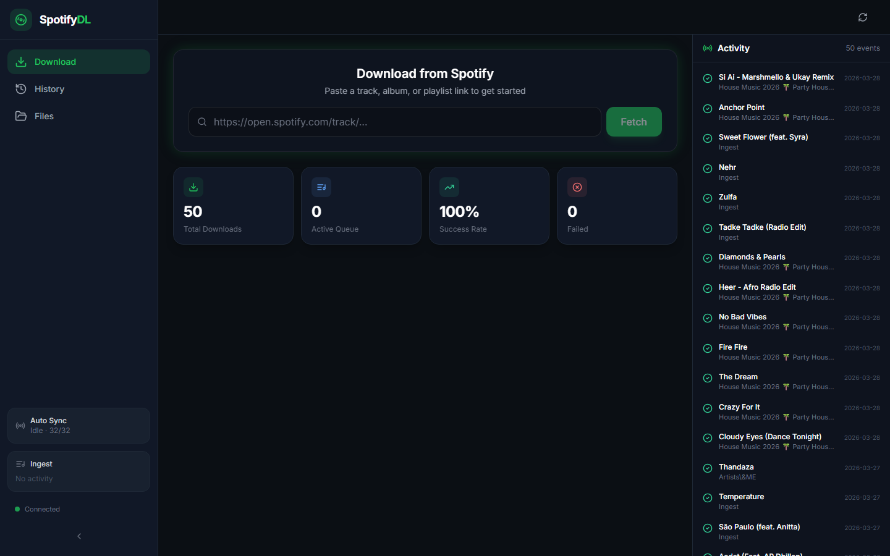
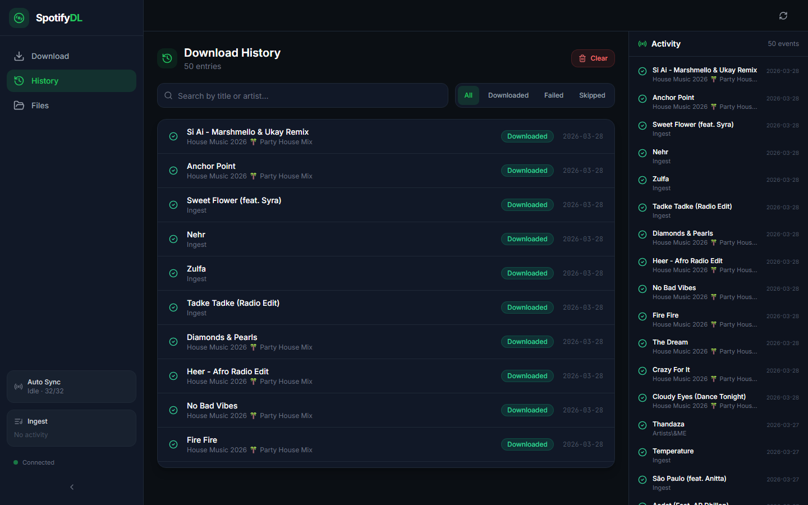
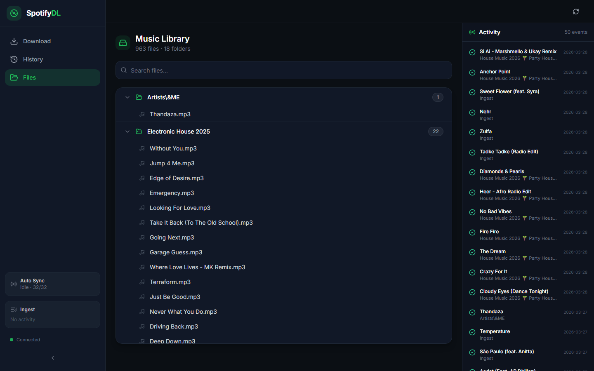

# 🎧 Spotify-Based Intelligent Music Downloader with Auto Playlist Sync

A full-stack, real-time music pipeline that converts Spotify links into high-quality MP3 downloads using intelligent source matching, multi-source fallback, and automated playlist monitoring.

---

## 🚀 Features

* 🎯 **Manual Download**

  * Paste Spotify track/album/playlist links
  * Fetch metadata (title, artist, duration)
  * Download & convert to MP3 (192 kbps)

* 🔁 **Auto Playlist Sync**

  * Monitors a Spotify playlist
  * Detects newly added tracks
  * Downloads automatically

* 📥 **Ingest System (No OAuth)**

  * Copy songs into a public “Ingest Playlist”
  * App auto-detects and downloads
  * Works with any playlist

* 🧠 **Smart Matching Engine**

  * Multi-factor scoring (title, artist, duration, official boost)
  * Keyword exemption system for remix/edit tracks
  * 30s hard duration ceiling to prevent wrong downloads

* ⚡ **Multi-Stage YouTube Search**

  * 3-stage fallback (official audio → audio → general)
  * Improves reliability and success rate

* 📁 **Auto File Organization**

  * Organizes by Artist / Playlist / Custom rules

* 📊 **Real-Time Dashboard**

  * Live queue, progress, activity feed (Socket.IO)

* 🛡️ **Rate Limit Handling**

  * Caching + reduced polling
  * Graceful handling of Spotify API limits

---

## 🏗️ Architecture

```text
Frontend (React + Tailwind + Socket.IO)
        ↓
Flask Backend (API + WebSocket)
        ↓
Spotify API (Metadata)
        ↓
Matching Engine (yt-dlp + scoring)
        ↓
FFmpeg (Audio conversion)
        ↓
Local Storage (organized files)
```

---

## 🧩 Tech Stack

**Frontend**

* React (Vite)
* Tailwind CSS
* ShadCN UI
* Socket.IO Client

**Backend**

* Flask + Eventlet
* Flask-SocketIO
* yt-dlp
* FFmpeg

**Other**

* Spotify Web API (Spotipy)
* Python (core logic)
* Caching layer (custom)

---

## ⚙️ How It Works

1. User provides Spotify link
2. Backend fetches metadata via Spotify API
3. Matching engine searches yt-dlp
4. Best candidate selected using scoring:

   * title similarity
   * artist match
   * duration check
5. Audio downloaded + converted via FFmpeg
6. File stored in organized directory
7. UI updates in real-time via WebSocket

---

## 🖥️ Screenshots

### Dashboard


### Download History


### File Browser


---

## 🛠️ Setup & Installation

### 1. Clone Repository

```bash
git clone https://github.com/Aswin-004/spotify-downloader.git
cd spotify-downloader
```

---

### 2. Backend Setup

```bash
cd backend
pip install -r requirements.txt
```

Create `.env`:

```env
SPOTIFY_CLIENT_ID=your_id
SPOTIFY_CLIENT_SECRET=your_secret
```

Run backend:

```bash
python app.py
```

---

### 3. Frontend Setup

```bash
cd frontend-react
npm install
npm run dev
```

---

## 📂 Project Structure

```text
backend/
  app.py
  downloader_service.py
  spotify_service.py
  auto_downloader.py
  cache/

frontend-react/
  src/
    components/
    pages/
    hooks/
    services/
```

---

## 📊 Key Engineering Highlights

* Designed **real-time pipeline** using Socket.IO
* Built **scoring-based matching engine** for accuracy
* Implemented **multi-source fallback system**
* Reduced API usage via **caching + rate-limit handling**
* Supports **scalable playlist processing (1000+ tracks)**

---

## 🚨 Challenges & Solutions

| Challenge           | Solution                         |
| ------------------- | -------------------------------- |
| Spotify Rate Limits | Caching + reduced polling        |
| Wrong Song Matches  | Scoring + title cleaning         |
| yt-dlp Errors       | Format fallback (bestaudio/best) |
| Over-filtering      | Multi-factor scoring + keyword exemption |

---

## 🚀 Future Improvements

* Dockerization
* Cloud deployment (Render / Vercel)
* User authentication
* Audio fingerprinting for duplicate detection
* Microservices architecture

---

## 📜 License

This project is for educational purposes.

---

## 🙌 Author

**Aswin Abhinab Mohapatra**
📧 [aswin.abhinab22@gmail.com](mailto:aswin.abhinab22@gmail.com)
🔗 https://github.com/Aswin-004
